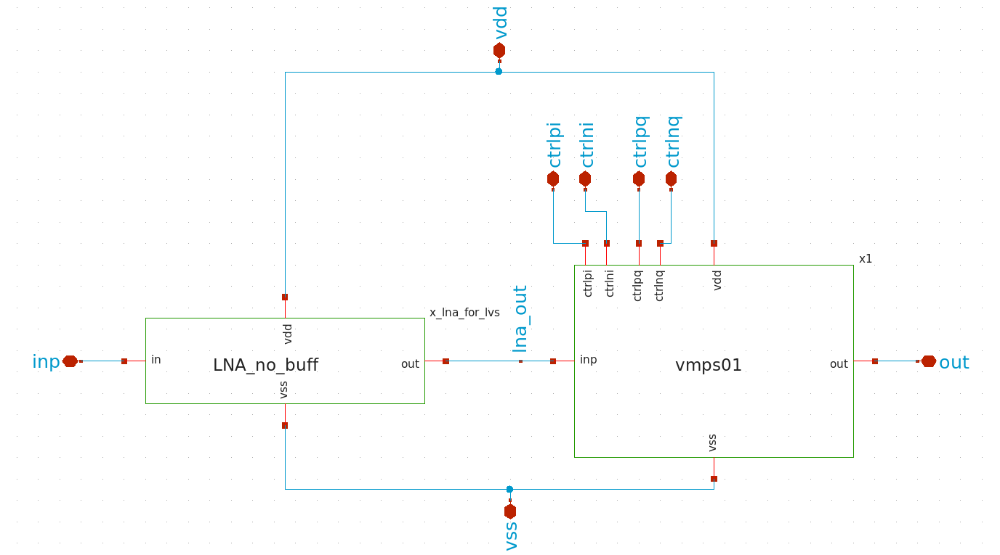
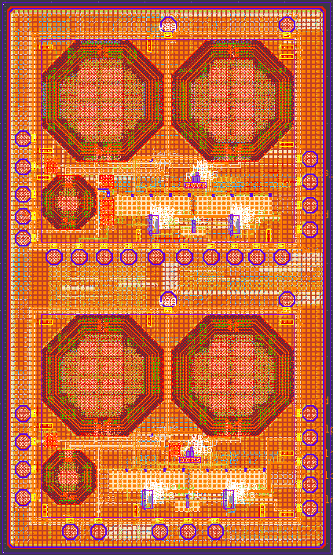

# LNA7096: PP-LNA (Programmable Phase Low Noise Amplifier)

## Overview
The **Programmable Phase Low Noise Amplifier (PP-LNA)** is a RF front-end circuit designed for navigation receivers operating in the L5 band (1.176 GHz). It integrates a Low Noise Amplifier (LNA) and a programmable Vector Modulator Phase Shifter (VMPS) on single silicon die. 

By enabling per-antenna phase control, this single-die solution is ideal for Controlled Reception Pattern Antenna (CRPA) systems. It allows for beamforming and creation of spatial nulls to suppress directional jammers in applications where space, weight and power (SWaP) constraints are there.  

## Key Performance Specifications
* **Process Node**: IHP 130 nm CMOS (SG13G2 PDK).
* **Center Frequency**: 1.176 GHz (L5 Band).
* **Power Supply & Consumption**: 1.2 V core, consuming 29.3 mW.
* **Forward Chain Gain (S21)**: 13.4 dB.
* **Noise Figure (NF)**: 1.25 dB.
* **Phase Control**: Full 360° range with 64 discrete steps (6-bit, 5.625° resolution).

## Architecture & Schematic
The PP-LNA architecture cascades a Cascode NMOS LNA directly with the VMPS block. The LNA provides initial voltage gain with a low noise figure, and its unbuffered output directly drives the capacitive MOS gate of the VMPS to optimize inter-stage voltage transfer and minimize losses. The VMPS splits the amplified signal into In-phase (I) and Quadrature (Q) components, scales them via Variable Gain Amplifiers (VGAs) based on a 6-bit digital control code, and performs vector summation to achieve programmable phase rotation. 

  

## Physical Implementation & Layout
The full chip layout is partitioned into two primary functional regions to support both system-level verification and independent block characterization.  

  

## Open-Source EDA Flow
This project serves as a proof-of-concept for developing high-performance, jammer-resilient RF hardware using a fully open-source Analog/RF IC design flow. The Ubuntu-based Linux toolchain includes:
* **Xschem & Ngspice**: Schematic capture and primary circuit simulation.
* **KLayout**: Physical design, Design Rule Check (DRC), Layout Versus Schematic (LVS) and density verification.
* **Qucs-S**:  RF S-parameter analysis.
* **OpenEMS**: Full-wave 3D electromagnetic simulation for extracting accurate S-parameter models of on-chip inductors.
